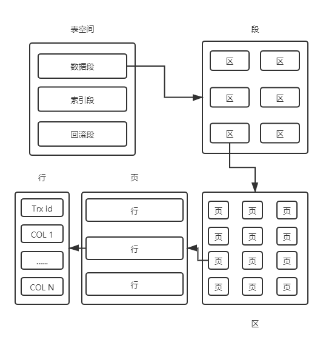

= MySQL

MySQL是一个关系型数据库管理系统（Relational Database Management System ：RDBMS）

MySQL逻辑架构:

* 连接管理与安全性
[indent=0]
----
负责连接管理、授权认证、安全等等
客户端每一个请求都会对应服务器的一个线程
为了避免每次都创建和销毁，服务器端会维护一个连接池
当客户端连接到MySQL服务器时会对其认证（通过用户名+密码、SSL证书）
----

* 查询缓存
[indent=0]
----
MySQL的QC默认是关闭的，可以通过 show variables like '%query_cache%'; 命令查看
QC的原理就是将查询语句通过Hash计算得到一个Hash值，通过这个Hash值去QC缓存查找是否有数据集有则返回
由于QC对结果的命中率低&可能会发生Hash冲突，以及当数据表有更新操作会对QC的内存块需要进行锁定
会对性能有很大的影响。
MySQL 8+ 已移除对QC的支持
----

* 解析器
[indent=0]
----
解析器主要对查询的SQL进行了词法分析和语法分析产生一颗解析树
select username from users
词法分析将整个SQL语句打碎成一个个单词(Token) 如
----
|===
|关键字 |非关键字 |关键字 |非关键字

|select
|username
|from
|users
|===
----
语法分析是根据MySQL定义的语法规则生成对应的数据结构 如 一个查询语句的语法树
                select 语法

    select   fields    from    Tables
                |                |
             username           users

然后在根据MySQL的规则进一步解析语法树的正确性，如检查表名、列名、表的权限等等
----
* 优化器
[indent=0]
----
----

* 存储引擎
[indent=0]
----
存储引擎是数据库管理系统用来数据库创建、读取和更新数据的软件模块
MySQL支持的存储引擎有8种可以通过命令查看： show engines;
常用的引擎有两种 InnoDB（5.5.8+默认）、MyISAM
----

==  表空间

索引是以页为单位保存的，一个页的大小默认为16K

== 索引与算法
索引是一种单独的、物理的对数据库表中一列或多列的值进行排序的一种存储结构，
它是某个表中一列或若干列值的集合和相应的指向表中物理标识这些值的数据页的逻辑指针清单

|===
|[索引列] |指针 |[索引列1，索引列2] |指针

|1
|page 2 的指针
|(1,3)
|page 1 的指针

|===

InnoDB引擎中支持的索引

* B+Tree
----
树的种类：二叉树 -> AVL树 -> 红黑树
多路查找树：2-3树 -> 2-3-4树 -> B树 -> B+树
为了更好的了解各路树建议：手写各种树
https://www.cs.usfca.edu/~galles/visualization/AVLtree.html
https://www.cs.usfca.edu/~galles/visualization/BTree.html
https://www.cs.usfca.edu/~galles/visualization/BPlusTree.html

B-Tree 非叶子节点既保存索引值和指针又有数据
B+Tree 非叶子节点只保存索引值和指针

B+树可以更好的结合磁盘IO原理提高查询效率

----
* Hash索引
----
https://www.cs.usfca.edu/~galles/visualization/OpenHash.html
----
* 全文索引（倒排索引）